# 🧑🏼‍💻 Comandos git

GIT es un sistema de control de versiones ampliamente utilizado, creado en 2005 por Linus Torvalds que también es conocido por ser el creador del kernel de Linux.

Un sistema de control de versiones permite gestionar y rasterar el estado de un código en diferentes momentos del desarrollo

## Indice
- [Secciones de un proyecto en git](#secciones-de-un-proyecto-de-git)
- [Inicializar y guardar cambios en un repositorio local](#inicializar-y-guardar-cambios-en-un-repositorio-local) 
- [Revisar commits realizados](#revisar-commits-realizados)
- [Etiquetar commits y ver diferencias](#etiquetar-commits-y-ver-diferencias)
- [Crear un repositorio remoto en GitHub y subir nuestro repositorio local](#crear-un-repositorio-remoto-en-github-y-subir-nuestro-repositorio-local)
- [Deshaciendo commits](#deshaciendo-commits)
- [Archivo .gitignore](#archivo-gitignore)
- [Usar git y GitHub con un par de claves ssh](#usar-git-y-github-con-un-par-de-claves-ssh)
- [Resolución de conflictos]()
- [Creación de ramas](#creación-de-ramas)
- [Fusión y eliminación de ramas](#fusión-y-eliminación-de-ramas)

## 🏘️ Secciones de un proyecto de git
Un proyecto de git contiene varias secciones:

- Directorio de trabajo: el directorio de trabajo en git es una carpeta donde se
almacena la versión con la que se esté trabajando del proyecto (código fuente y
archivos necesarios para el funcionamiento del proyecto) y los metadatos del
mismo (por ejemplo la carpeta .git).
- Área de preparación: el área de preparación es una zona intermedia del proyecto
antes de confirmar los cambios que se van a realizar. Más concretamente se trata
de un archivo que contiene información sobre la próxima confirmación de
cambios.
- Repositorio: son los archivos con los que git va a trabajar. La configuración del
repositorio está definida en la carpeta .git. Por ejemplo, puedes configurar
algunos archivos para que git no pueda hacer nada con ellos, es decir, los ignore
con el archivo .gitignore; de esta forma, esos archivos ya no formarían parte del
repositorio.

    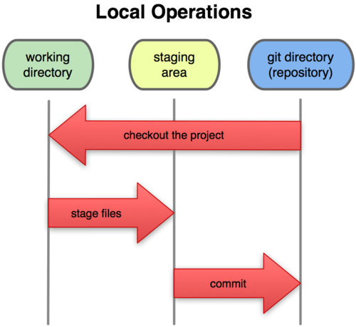

## 🚩 Inicializar y guardar cambios en un repositorio local
Ahora explicaré la manera de crear un repositorio local en git una vez esté instalado:
- Primero de todo hay que inicializar el repositorio escribiendo el comando `git init` dentro del directorio elegido y dentro se creará una carpeta .git que contiene información del repositorio y por lo tanto, indica que ha sido creado.

- Después hay que iniciar el proyecto que vayamos a hacer creando por ejemplo algún archivo como un readme para tener algo de contenido para una primera versión.
- Para registrar esos cambios y empezar con el repositorio, hay que escribir los comandos `git add .` (para añadirlos al stagging area) donde el punto indica todos los archivos del directorio y `git commit -m "mensaje descriptivo de los cambios"` (para confirmar los cambios).

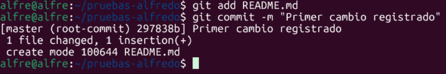

## 👀 Revisar commits realizados
Para revisar los commits realizados en un repositorio se usa el comando `git log --oneline --all` esas son unas de las muchas opciones que tiene el comando `git log` y para ir a un commit concreto se puede usar el comando `git checkout id_commit`.

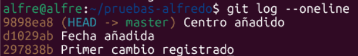

## 🏷️ Etiquetar commits y ver diferencias
Etiquetar un commit consiste en ponerle un *nombre* para identificarlo, esto se hace para hacer una *release* y no se debe hacer en todos los commits. Esto se logra con el comando `git tag -a "nombre version" -m "mensaje para la versión" id_commit`.

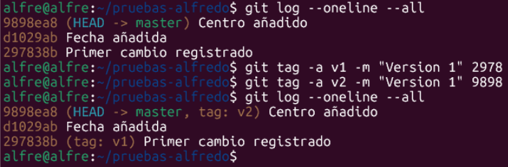

Ahora hablaré de como ver las diferencias entre commits. Se puede hacer con dos comandos: 
- `git show id_commit` que nos muestra los cambios añadidos en un commit concreto 

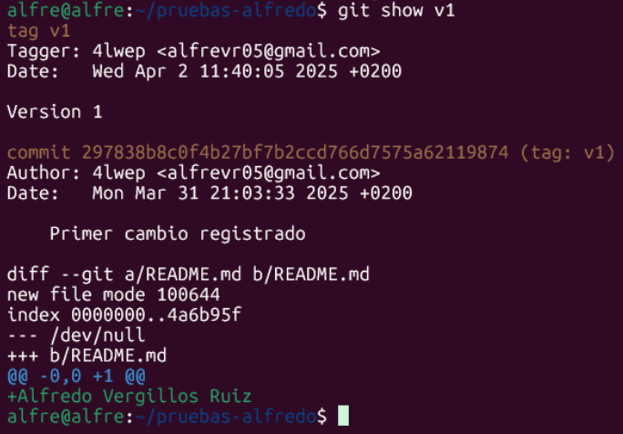

- `git diff commit_primero..commit_segundo` que muestra la diferencia de un commit respecto a otro.

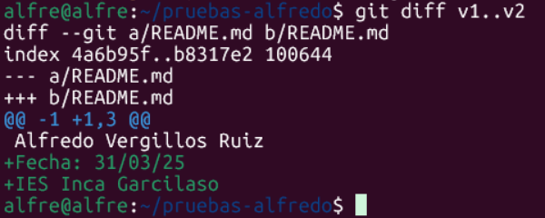

## ☁️ Crear un repositorio remoto en GitHub y subir nuestro repositorio local
Ahora vamos a subir un repositorio que tengamos en nuestro equipo local a GitHub.
Para esto primero hay que crear una cuenta en GitHub, después, en la página de nuestro perfil, darle al signo + y en *New repository*, colocamos el nombre de repositorio y el resto de cosas se dejan por defecto. 

Después GitHub nos dará los enlaces para acceder a nuestro repositorio remoto. Elegiremos el enlace de HTTPS.

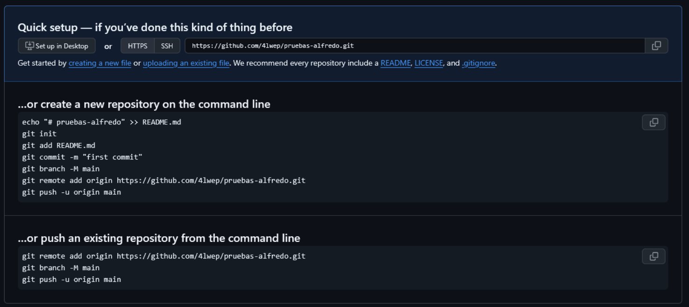

Ahora en el repositorio local escribimos el comando `git add origin https://github.com/usuario/repositorio.git` para asignar el repositorio local al remoto que acabamos de crear. Por último, con el comando `git push -u origin master` subimos los archivos del repositorio local al remoto, además, con el comando `git push --tags` se pueden subir las etiquetas que hayamos creado.

## 🔄 Deshaciendo commits
Se pueden desahacer los cambios de un repositorio antes de hacer un commit escribiendo el comando `git reset --hard`.

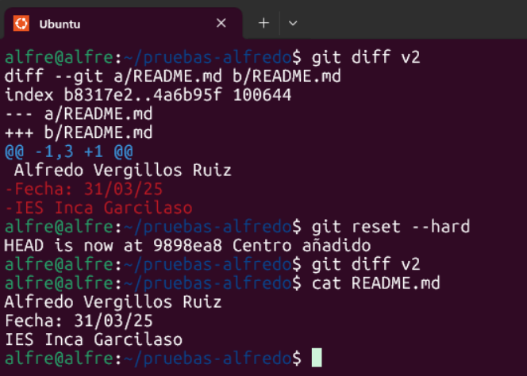

Si ya llegamos a hacer el commit y queremos revertir los cambios se escribe el
comando añadiendo `git reset --hard HEAD~1` donde el 1 de *HEAD~1* es la cantidad de commits hacia atrás que queremos ir, en este caso, un commit.

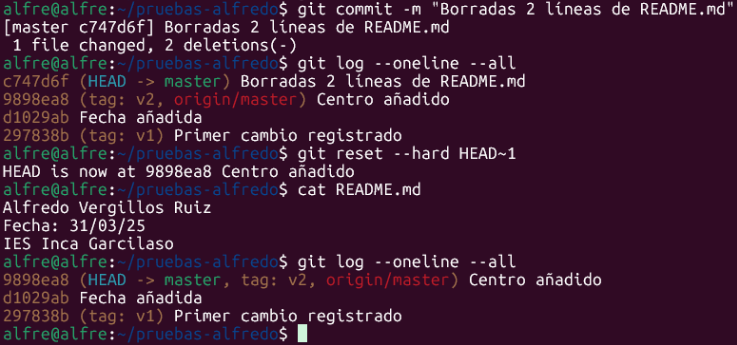

## 🚫 Archivo .gitignore
El archivo .gitignore es un archivo oculto dentro de nuestro repositorio que nos permite excluir los archivos que le indiquemos del repositorio, es decir, git no trabajará con ellos y no se subirán al repositorio remoto cuando hagamos push

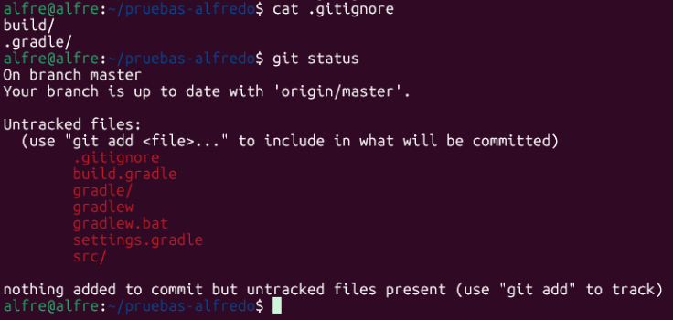

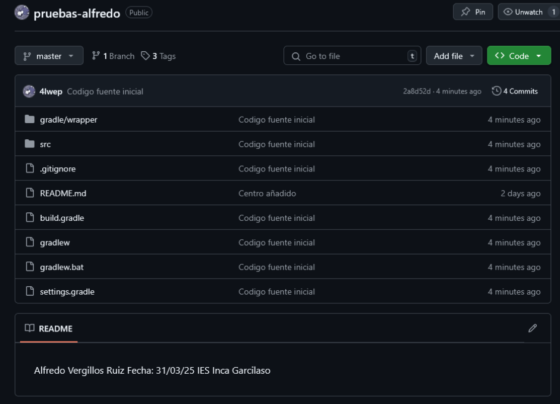

## 🤝🏼 Usar git y GitHub con un par de claves SSH
Hemos visto que se puede usar GitHub en colaboración con GIT gracias a un enlace https, sin embargo, también podemos conectar nuestro repositorio local con el de GIT usando un par de claves SSH. para esto tenemos que generar esas claves con el comando `ssh-keygen` y generará dos archivos en un repositorio .ssh. 

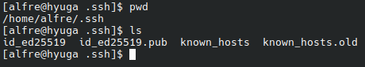

Después, hay que ir a la configuración de tu perfil en GitHub y en el apartado de **SSH and GPG keys** añadimos una nueva clave SSH, ahí pegamos el contenido del archivo dentro de .ssh que acabe en .pub. Después de esto ya podremos usar el enlace de SSH de nuestro repositorio remoto para tenerlo sincronizado con nuestro repositorio local.

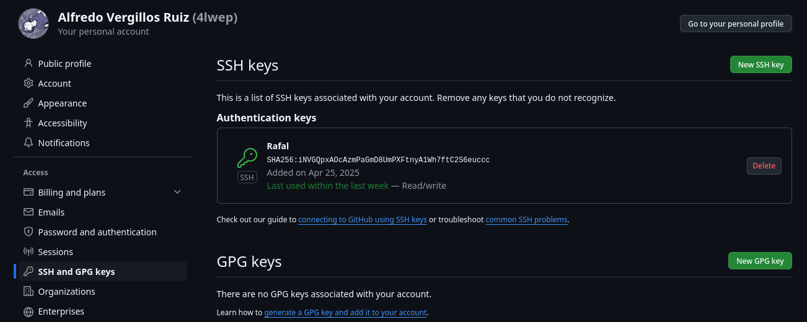

## ✔️ Resolución de conflictos
Un conflicto se produce cuando en un mismo commit uno o varios archivos son diferentes en el repositorio local y en el remoto, si intentamos subir los cambios del repositorio local al remoto nos dará error y nos pedirá que actualicemos el repositorio local con el comadno `git pull` y al hacer esto es que nos avisará que hay conflictos ya que archivos que deberían ser iguales no lo son, por lo tanto, al intentar modificar esos archivos, se pedirá al usuario que elija alguna de las dos versiones del archivo. Apareceran las siguientes marcas:
- `<<<<<<<`: indica las líneas en el commit local
- `=======`: indica las líneas sin conflictos
- `>>>>>>>`: indica las líneas en el commit remoto 
Una vez elijamos la versión que queremos hacemos commit y ya se podrá subir al repositorio remoto.

## 🪾 Creación de ramas
Una rama sirve para desarrollar distintas partes de un proyecto o para crear distintas versiones de este y desarrollar estar versiones todo en paralelo.

Una rama se puede crear a partir de cualquier commit con el comando `git checkout -b nombre-rama commit-de-partida` de esta forma crearemos la rama y cambiaremos a ella, esta rama se habrá creado con los contenidos del commit en el que estuvieramos o del commit indicado si hay y a partir de ahí puede seguir su propio camino en el desarrollo sin afectar a la rama principal. Para cambiar entre ramas se usa en comando `git checkout nombre-de-la-rama` para ver las ramas existentes y en cuál estamos, `git branch` y para ver los commits de un repositorio incluyendo las distintas ramas y de manera gráfica usamos `git log --oneline --all --graph`. 

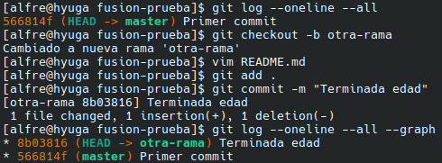

Además, las ramas se pueden crear sin cambiar a ellas automáticamente con el comando `git branch nueva-rama` o `git branch nueva-rama commit-de-partida` si queremos crear la rama a partir de otro commit que no sea el actual.
Para subir información a un repositorio remoto hemos visto que se usa el comando `git push origin master` donde master es el nombre de la rama principal, sin embargo, ahora que tenemos más ramas, se puede usar `git push origin --all` para subir todas las ramas o cambiar master por el nombre de las ramas concretas que queramos subir.

## 🫂 Fusión y eliminación de ramas
Para eliminar una rama se puede usar el comando `git branch -d  nombre-rama` si la rama no se ha añadido a la rama master, dara un error y habrá que poner el comando `git branch -D nombre-rama` para forzar la eliminación. Para fusionar una rama con otra habrá que usar el comando `git merge nombre-rama` y los cambios dentro de la rama indicada se añadirán a la rama en la que estamos actualmente

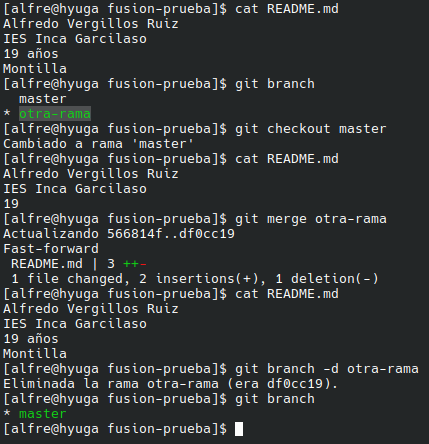