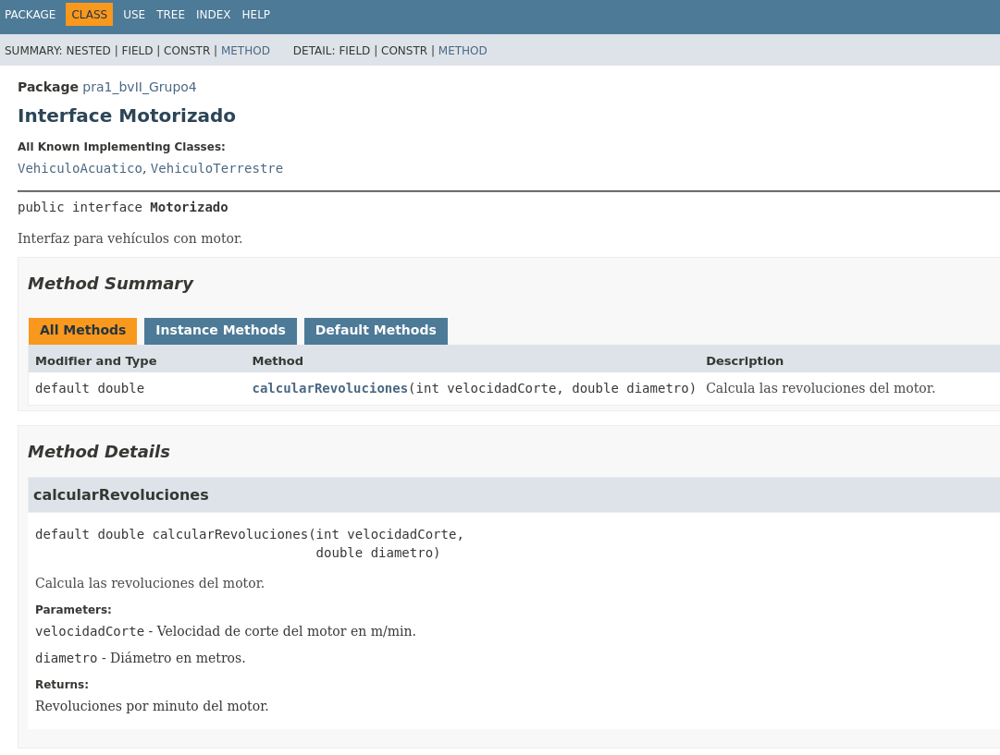

# Documentación en javadoc
La documentación con javadoc sirve para explicar el funcionamiento de una programa en java 

```java
/***
 * Esto es un comentario javadoc
 * /
```
Para documentar con javadoc se tiene que usar este formato de comantarios en el código de la aplicación, estos comentarios luego aparecerán en el javadoc

```java
/**
 * Clase para realizar operaciones
*/

public class Operaciones{
    /**
     * Permite sumar dos números enteros
    */
    public static int suma(int n1, int n2){
        return n2;
    }
}

...
```
## ETIQUETAS
Además de esos comentarios simples, javadoc nos proporciona una serie de etiquetas que podemos usar para diferentes cosas. Estas son algunas de ellas:

- @author: Indica el autor o autores de un proyecto
- @deprecated: Añade un comentario de que este API no debería volver a usarse
- @param: Añade un parámetro y su descripción 
- @return: Añade el tipo de retorno de un método
- @throws: Añade la cabecera Throws a la documentación con la excepción que puede ser lanzada por un método
- @version: Añade la cabecera con versión de una clase

## EJEMPLO
Así se ve la página principal del javadoc de un proyecto


Un ejemplo concreto de una interfaz es el siguiente:

```java
package pra1_bvII_Grupo4;

/**
 *
 * @author Alex
 */
/**
 * Interfaz para vehículos con motor.
 */
public interface Motorizado {
    /**
     * Calcula las revoluciones del motor.
     * @param velocidadCorte Velocidad de corte del motor en m/min.
     * @param diametro Diámetro en metros.
     * @return Revoluciones por minuto del motor.
     */
    default double calcularRevoluciones(int velocidadCorte, double diametro) {
        return (1000 * velocidadCorte) / (Math.PI * diametro);
    }
}
```
Este código genera el siguiente javadoc

