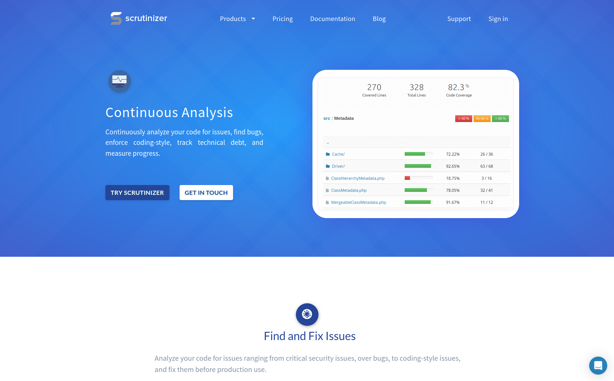
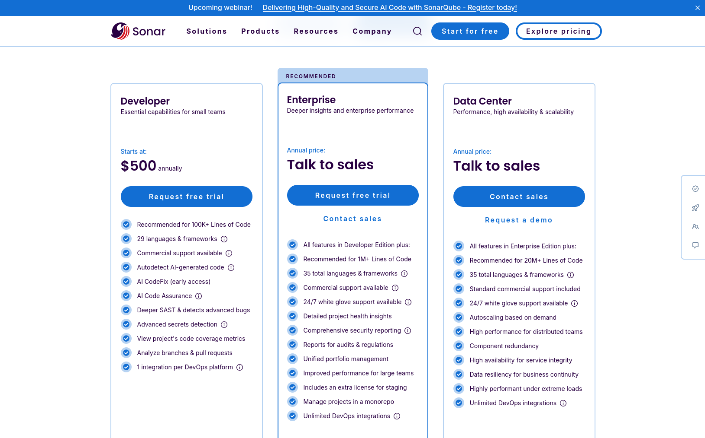

# 🚀 Optimización de código Java

La optimización de código busca lograr el el código más eficiente posible sin perjudicar al funcionamiento del programa.
1. [Hendiondez](#hendiondez)
2. [Análisis de código](#análisis-de-código)
    1. [Análisis estático](#1-análisis-estático)
    1. [Análisis dinámico](#2-análisis-dinámico)
3. [Continuous Inspection o Continuous Analysis](#continuous-inspection-o-continuous-analysis)
4. [Refactorización](#refactorización)

## Hendiondez
La Hendiondez o code smell es indica que el código tiene un problema profundo. No un problema de funcionamiento como tal, si no un problema de diseño que puede daar lugar a problemas para entender el código o problemas de escalabilidad

## 📊 Análisis de código

El análisis de código consiste en analizar el código en una aplicación en busca de posibles mejoras

### 1. Análisis estático

El análisis estático de código permite analizar el código antes de ejecutarlo

#### Linters
Los linters son programas que ofrecen la posibilidad de analizar de forma estática el código, algunos ejemplos son:

- `Lint` para C
- `Sonar` para Java
- `JSLint` o `ESLint` para Javascript

### 2. Análisis dinámico

El análisis dínamico sirve para analizar el funcionamiento del programa durante la ejecución, se puede realizar con tests donde se indica cual es el valor esperado de una función y el test nos hace saber si el valor es correcto o no

Un test en java se vería de esta forma:
```java
@Test
public void comprobarSuma() {

	int resultado = sumar(2, 2);
	int valorEsperado = 4;

	assertEquals(valueExpected, result);
}
```

## 🔍 Continuous Inspection o Continuous Analysis

Continuos inspection consiste en analizar un código en busca de bugs para resolver

Algunos sitios web que ofrecen este servicio son: 

- #### Scrutinizer
    Da soporte para PHP, Python y Ruby y tiene varios planes: el básico a 49€ al mes, profesional a 99€ al mes y el unlimited a 199€ al mes

    
- #### SonarQube
    Da soporte a multitud de lenguajes y tiene un periodo de 14 días de prueba gratuita, tras la prueba, tiene varios planes al igual que el anterior: plan developer por 160€ al año, plan enterprise por 21000€ al año y plan data center por 136000€ al año
    

## 💪🏼 Refactorización

La refactorización consiste en inspeccionar el código fuente buscando reestructurarlo de la manera más optimizada posible. Existen diferentes prácticas que se llevan a cabo: 

- Renombrado de variables 
```java
//Antes
int a = 10;
int b = 20;
int c = a + b;
System.out.println(c);
// a, b y c no tienen ningún significado
```

```java
//Después
int manzanas = 10;
int peras = 20;
int fruta = manzanas + peras;
System.out.println(fruta);
```
- Pasar código duplicacado a funciones 
```java
//Antes
public static void main(String args[]){
    int[] numeros = {9, 5, 1, 6, 8, 1};

    int mayor = 0;
    for (int numrero : numeros){ //Bucle para buscar el mayor entero en el array
        if (numero > mayor){
            mayor = numero;
        }
    }

    int[] numeros2 = {7, 2, 4, 9, 3, 5};

    mayor = 0;
    for (int numrero : numeros){ //Bucle para buscar el mayor entero en el array otra vez
        if (numero > mayor){
            mayor = numero;
        }
    }
}
```

```java
//Después
public static void main(String args[]){
    int[] numeros = {9, 5, 1, 6, 8, 1};
    encontrarNumeroMayor(numeros);
    int[] numeros2 = {7, 2, 4, 9, 3, 5};
    encontrarNumeroMayor(numeros2);
}

public static void encontrarNumeroMayor(int[] lista){
    int mayor = 0;
    for (int numero : lista){
        if (numero > mayor){
            mayor = numero;
        }
    }
    return mayor;
}
```
- Eliminación de código inalcanzable
```java
//Antes
public static void encontrarNumeroMayor(int[] lista){
    int mayor = 0;
    for (int numero : lista){
        if (numero > mayor){
            mayor = numero;
        }
    }
    return mayor;

    mayor - 1; // Esta línea nunca se ejecutará ya que la función devuelve un valor antes
}
```

```java
//Después
public static void encontrarNumeroMayor(int[] lista){
    int mayor = 0;
    for (int numero : lista){
        if (numero > mayor){
            mayor = numero;
        }
    }
    return mayor;
}
```
- Eliminación de código redundante
```java
//Antes
int a = 10;
int b = 20;
int c = b * 1 // b * 1 es lo mismo que b por lo que eso es innecesario
return a + c;
```

```java
//Después
int a = 10;
int b = 20;
return a + b;
```
- Eliminación de código muerto
```java
//Antes
int a = 10;
int b = 20;
int c = 40; // El valor de c nunca es usado para nada
return d = a + b;
```

```java
//Después
int a = 10;
int b = 20;
return d = a + b;
```